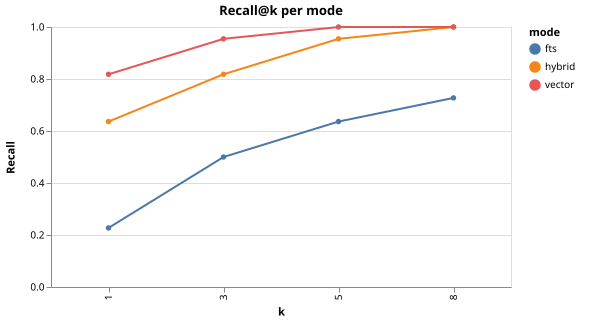
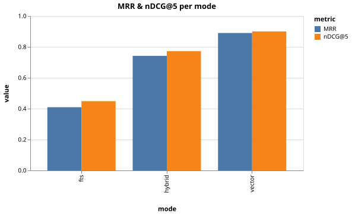
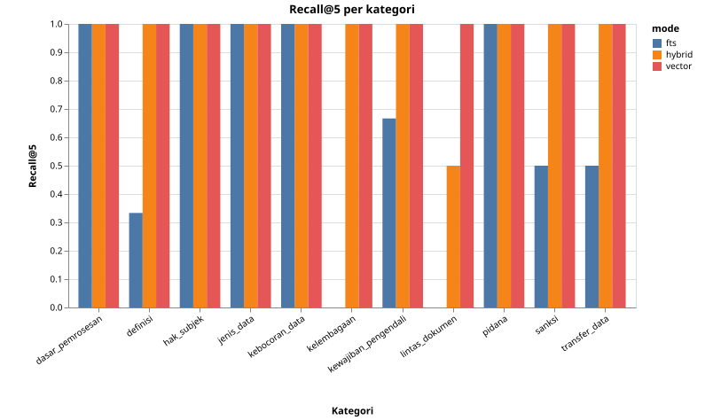
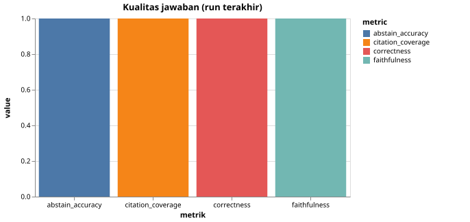
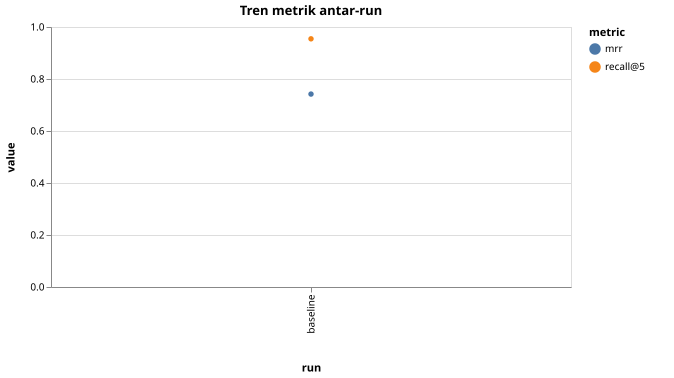

# Evaluasi RAG PDP

Dihasilkan otomatis oleh `eval/run.ts`. Chart di `reports/charts/`.

## Ringkasan run

| Run | modes | k | Recall@5 (hybrid) | MRR (hybrid) | Citation cov. | Abstain acc. | Faithfulness | Correctness |
|---|---|---|---|---|---|---|---|---|
| baseline | hybrid,vector,fts | 8 | 0.95 | 0.74 | 0.00 | 0.00 | - | - |
| baseline-chat | hybrid,vector,fts | 8 | - | - | 1.00 | 1.00 | 1.00 | 1.00 |

## Chart

### Recall@k per mode

### MRR & nDCG@5 per mode

### Recall@5 per kategori

### Kualitas jawaban

### Tren antar-run

