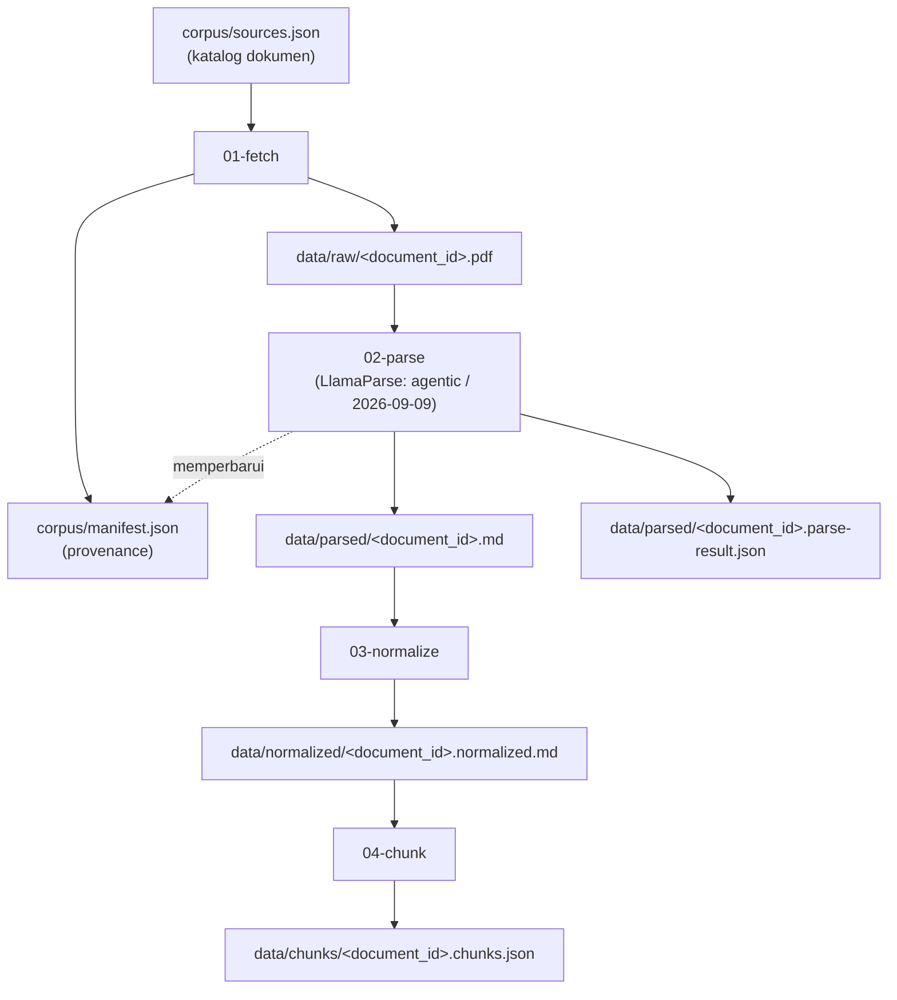

# Ingestion - Data Lineage

Dokumen ini merekam asal-usul (lineage) data pada pipeline ingestion, dari
pengambilan dokumen (fetch) sampai pembentukan chunk. Semua path relatif
terhadap direktori `ingestion/` (cwd saat menjalankan `npm run <script> -w ingestion`).

## 1. Diagram alur



## 2. Katalog dokumen - `corpus/sources.json`

Sumber kebenaran daftar dokumen (dikurasi manual). Struktur: `corpus_version`,
`parse_defaults` (`tier`, `version`), dan `documents[]`.

| `document_id` | Jenis | Nomor/Tahun | Sumber | `source_url` |
|---|---|---|---|---|
| `uu-27-2022` | UU | 27/2022 | JDIH BPK | `peraturan.bpk.go.id/Download/224884/...` |
| `pp-71-2019` | PP | 71/2019 | JDIH Kemenkeu | `jdih.kemenkeu.go.id/api/download/fulltext/2019/71TAHUN2019PP.pdf` |

`enabled: false` menonaktifkan dokumen. Field `parse` per dokumen (opsional)
menimpa `parse_defaults`.

## 3. Manifest provenance - `corpus/manifest.json`

File generated (gitignored). Merekam hasil tiap tahap per dokumen.

| Field | Diisi oleh | Arti |
|---|---|---|
| `document_id` | fetch | kunci dokumen |
| `source_url` | fetch | URL unduhan |
| `status` | fetch | `downloaded` / `verified` / `manual-required` / `missing` |
| `retrieved_at` | fetch | waktu unduh (ISO 8601) |
| `bytes` | fetch | ukuran PDF |
| `sha256` | fetch | sidik jari PDF |
| `parsed_at` | parse | waktu parse |
| `parsed_sha256` | parse | `sha256` PDF saat parse dijalankan |
| `parse_signature` | parse | `sha256:tier:version` - penentu skip/re-parse |

## 4. Tahap demi tahap

### 01-fetch - `src/pipeline/01-fetch.ts`

- Masuk: `corpus/sources.json`, manifest lama.
- Proses: unduh PDF (`fetch` bawaan Node) dengan `User-Agent`, redirect,
  timeout 60 detik, retry 3 kali. Verifikasi magic bytes `%PDF-` dan ukuran
  minimal 10 KB. Hitung SHA-256. Fallback manual bila situs memblokir.
- Keluar: `data/raw/<document_id>.pdf`; manifest diperbarui.
- Idempoten: skip bila file ada dan `sha256` cocok dengan manifest.

### 02-parse - `src/pipeline/02-parse.ts`

- Masuk: `data/raw/<document_id>.pdf`.
- Proses: unggah ke LlamaCloud lalu `parsing.parse` dengan tier dan versi dari
  `sources.json` (`agentic` / `2026-09-09`). Respons v2 berbentuk
  `result.markdown.pages[]`; markdown direkonstruksi per halaman dan diberi
  penanda `--- Halaman <page_number> ---`.
- Keluar: `data/parsed/<document_id>.md` dan
  `data/parsed/<document_id>.parse-result.json` (respons mentah, arsip).
  Manifest diperbarui (`parsed_at`, `parsed_sha256`, `parse_signature`).
- Idempoten: skip bila `parse_signature` cocok. Mengubah `tier`/`version`
  memicu re-parse otomatis.

### 03-normalize - `src/pipeline/03-normalize.ts`

- Masuk: `data/parsed/<document_id>.md`.
- Proses: membersihkan artefak hasil parsing:
  - buang `logo:`, `seal:`, `[signature:`;
  - buang nomor halaman berdiri sendiri (`- 12 -`);
  - deduplikasi running header `PRESIDEN` / `REPUBLIK INDONESIA`;
  - buka penanda blockquote (`>`);
  - normalkan bullet `* a.` menjadi `a.`;
  - tangani penanda kontinuasi `. . .`, termasuk yang terpotong oleh page break
    (fragmen terpotong dibuang bila halaman berikutnya mengulang awalnya);
  - rapikan baris kosong berlebih.
- Keluar: `data/normalized/<document_id>.normalized.md`.
- Mempertahankan penanda `--- Halaman N ---` untuk provenance.
- Deterministik (tidak berbasis hash; aman dijalankan berulang).

### 04-chunk - `src/pipeline/04-chunk.ts`

- Masuk: `data/normalized/<document_id>.normalized.md`.
- Proses: structure-aware chunking mengikuti hirarki BAB / Bagian / Pasal /
  Ayat.
  - Transisi section: `pembukaan` -> `batang_tubuh` -> `pengesahan` ->
    `penjelasan`.
  - Unit utama chunk adalah ayat. Pasal tanpa ayat menjadi satu chunk.
  - Definisi Pasal 1 dipecah per angka.
  - Huruf tidak menjadi chunk tersendiri.
  - Awal `pengesahan` dideteksi via penanda baris (`Agar setiap orang
    mengetahuinya`, `Diundangkan di`, `Disahkan di`); peringatan dicetak bila
    tidak ditemukan.
  - Penjelasan Umum dipecah per paragraf; bagian "Pasal demi Pasal" menjadi
    satu chunk per pasal.
  - Guard anti-duplikat untuk ayat/angka/pasal yang terulang akibat page break.
- Keluar: `data/chunks/<document_id>.chunks.json`.
- Validasi sebelum menulis: tidak ada teks hilang, tidak ada `chunk_id`
  duplikat, tidak ada `text` kosong, format `chunk_id` valid.

## 5. Konvensi

### Penamaan file

`data/<stage>/<document_id>.<suffix>`. Daftar dokumen selalu diambil dari
`corpus/sources.json` (tidak di-hardcode).

### `chunk_id` (skema A, tanpa bab)

```
<document_id>:<section>:<...>

uu-27-2022:pembukaan
uu-27-2022:pengesahan
uu-27-2022:batang-tubuh:pasal-1:angka-3
uu-27-2022:batang-tubuh:pasal-16:ayat-2
uu-27-2022:batang-tubuh:pasal-60
uu-27-2022:penjelasan:umum:1
uu-27-2022:penjelasan:pasal-60
```

### `parent_id`

- chunk ayat/angka -> id pasal induk (`uu-27-2022:batang-tubuh:pasal-16`)
- paragraf Penjelasan Umum -> `uu-27-2022:penjelasan:umum`
- lainnya -> `null`

### Metadata chunk

`document_id`, `document_title`, `section`, `bab`, `bab_title`, `bagian`,
`pasal`, `pasal_number`, `ayat`, `ayat_number`, `angka`, `page_start`,
`page_end`, `text`, `parent_id`.

## 6. Reproducibility

- Checksum PDF (`sha256`) + `parse_signature` (`sha256:tier:version`) membuat
  fetch dan parse hanya berjalan bila sumber atau setelan berubah.
- Versi parser di-pin (`agentic` / `2026-09-09`) agar hasil parse konsisten.
- Normalize dan chunk bersifat deterministik: dijalankan ulang menghasilkan
  output identik.

## 7. Lingkungan dan perintah

- `.env` di `ingestion/` (salin dari `.env.example`):
  `LLAMA_CLOUD_API_KEY`, `GEMINI_API_KEY`.
- Perintah (dari root repo):
  - `npm run fetch -w ingestion`
  - `npm run parse -w ingestion`
  - `npm run normalize -w ingestion`
  - `npm run chunk -w ingestion`

## 8. Contoh output chunk

Contoh satu record dari `data/chunks/uu-27-2022.chunks.json`:

```json
{
  "chunk_id": "uu-27-2022:batang-tubuh:pasal-1:angka-3",
  "document_id": "uu-27-2022",
  "document_title": "Undang-Undang Nomor 27 Tahun 2022 tentang Pelindungan Data Pribadi",
  "section": "batang_tubuh",
  "bab": "BAB I",
  "bab_title": "KETENTUAN UMUM",
  "bagian": null,
  "pasal": "Pasal 1",
  "pasal_number": 1,
  "ayat": null,
  "ayat_number": null,
  "angka": 3,
  "page_start": 2,
  "page_end": 2,
  "text": "3. Informasi adalah keterangan, pernyataan, gagasan, dan tanda-tanda yang mengandung nilai, makna, dan pesan, baik data, fakta, maupun penjelasannya yang dapat dilihat, didengar, dan dibaca yang disajikan dalam berbagai kemasan dan format sesuai dengan perkembangan teknologi informasi dan komunikasi secara elektronik ataupun nonelektronik.",
  "parent_id": "uu-27-2022:batang-tubuh:pasal-1"
}
```

## 9. Inventaris data

Dihasilkan dari `corpus/sources.json` (corpus_version `pdp-v1`).

| `document_id` | `sha256` (PDF) | Halaman | Karakter parsed | Karakter normalized | Chunk |
|---|---|---|---|---|---|
| `uu-27-2022` | `ed952dea04b87d14ecf037f9f324a65d50b396ddd34fc28ddf9ff014391971f6` | 50 | 63771 | 61613 | 250 |
| `pp-71-2019` | `7a3106e7a37ae24d4131c4bcdf9069caae30c33ba37d84d8c4a65a76525b50c4` | 90 | 123946 | 119720 | 453 |

Jumlah chunk per section:

| `document_id` | pembukaan | batang_tubuh | pengesahan | penjelasan |
|---|---|---|---|---|
| `uu-27-2022` | 1 | 167 | 1 | 81 |
| `pp-71-2019` | 1 | 331 | 1 | 120 |
